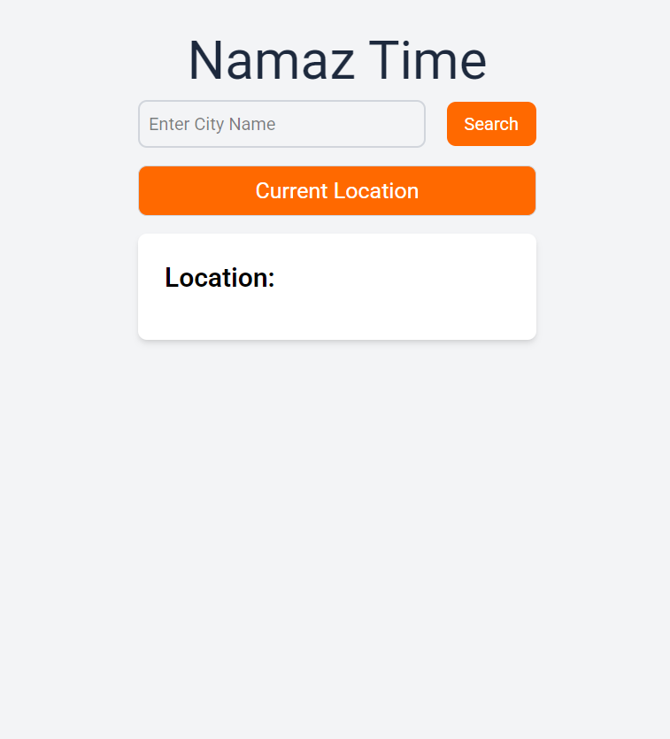
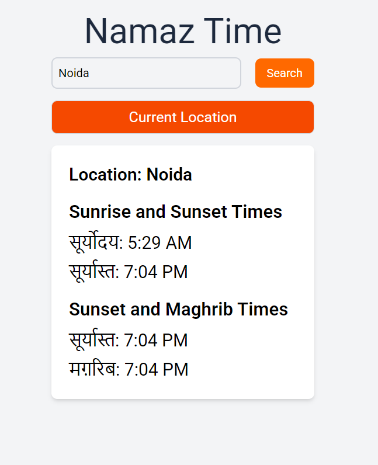

# Namaz Time App

A React application that displays prayer times (specifically sunrise, sunset, and Maghrib) based on the user's current location or a searched city.

 


## Features

- Get prayer times for your current location
- Search for prayer times by city name
- Displays sunrise, sunset, and Maghrib times
- Clean 12-hour format with AM/PM display
- Responsive design

## Technologies Used

- React.js
- Sunrise-Sunset API (https://api.sunrise-sunset.org)
- Nominatim OpenStreetMap API (https://nominatim.openstreetmap.org)
- Tailwind CSS for styling

## Installation

1. Clone the repository:
   ```bash
   git clone https://github.com/yourusername/namaz-time-app.git